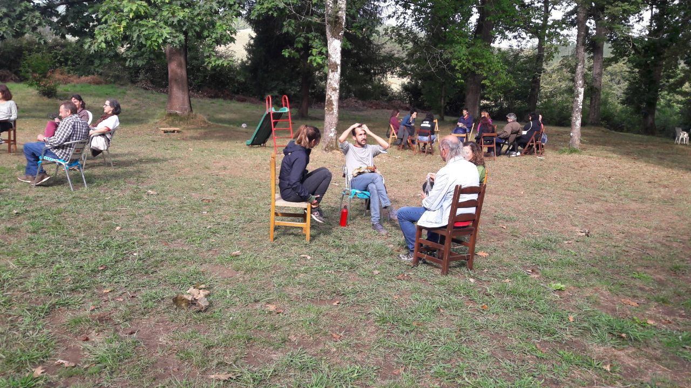

# Unha escola para a supervivencia

En pouco máis de dúas semanas, do 23 ao 25 de maio, arrincará en Allariz (Ourense) a próxima Escola Ramón Fernández Durán, unha escola para a reflexión e a acción colectiva dos movementos sociais que comezou en 2015 como iniciativa da coordinadora Baladre, CGT e Ecoloxistas en Acción, e que percorreu distintos lugares da península.

Desde entón, abordamos temas sociopolíticos de especial relevancia na conxuntura de cada edición, como as distintas crises: climática, económica, enerxética; a garantía dos dereitos básicos: alimentación, vivenda, saúde e coidados; a guerra e o militarismo; e, en xeral, alternativas para transitar cara unha sociedade poscapitalista.

Nesta ocasión, o tema central será a xestión de emerxencias e catástrofes relacionadas co proceso de colapso sistémico do actual modelo capitalista, poñendo a vida no centro e buscando satisfactores para as necesidades básicas da poboación a través da creación de redes de apoio mutuo e da autoxestión comunitaria.

As últimas catástrofes vividas, como a pandemia da COVID, a DANA de Valencia, a guerra de Ucraína, os lumes masivos ou o recente apagón, puxeron de manifesto a vulnerabilidade das nosas sociedades e a incapacidade das administracións, en situacións de colapso agudo, para garantir unha vida digna á súa poboación.
En moitas destas situacións, a poboación tivo que organizarse de xeito autónomo para facer fronte ás emerxencias cos recursos dispoñibles, improvisando respostas pouco eficientes, que non sempre resolveron as necesidades fundamentales e que non chegaron por igual a todas as persoas.

Estas experiencias puxeron de manifesto a importancia da autoxestión e da solidariedade en tempos de crise, así como a necesidade de construír redes de apoio mutuo que nos permitan enfrontar as crises e catástrofes que están por vir. A vida de milleiros de persoas depende da capacidade de resposta das súas comunidades e por iso decidimos dedicar a Escola 2025 a esta cuestión, que ademais de ser de vital importancia, é urxente.

Entre todas buscaremos formas de organización e ferramentas colectivas para garantir unha alimentación saudable e suficiente, unha vivenda digna, unha saúde integral tanto física como emocional, unha enerxía limpa e accesible para todas, etc. Traballaremos estas temáticas en tres obradoiros: o antes, o durante e o despois dunha catástrofe. En cada obradoiro abordaranse preguntas como Que hai que facer para favorecer unha satisfacción universal das necesidades?  
Que hai que facer para que os imaxinarios que se expandan sexan os ecosociais e non os da extrema dereita? Que aprendizaxes son necesarios? Que ferramentas e recursos materiais son imprescindibles? Que infraestruturas necesitamos?  
- Que tipo de organizacións? Que alianzas temos que priorizar?

Os obradoiros serán introducidos por persoas que vivíron situacións de emerxencia, quen contarán as súas experiencias e os principais retos que tiveron que afrontar. Contaremos con xentes da Koordinadora de Kolectivas do Parke Alcosa de Valencia que falaren da súa experiencia na DANA, de xentes da Palma que contarán a súa experiencia na erupción do volcán Cumbre Vieja, da realidade dos barrios marxinados e colapsados como as villas miseria de Arxentina, ou de expertas e expertos técnicos en emerxencias no ámbito sanitario e de bombeiros.

Tras as breves exposicións, abrirase un espazo de diálogo, reflexión e construción colectiva onde trataremos de dar respostas pragmáticas ás preguntas plantexadas. E é que esta escola non é un espazo académico, senón un espazo de encontro e intercambio de aprendizaxes baseadas en experiencias.

Pero a Escola non é só un espazo de formación, senón sobre todo un espazo de encontro e convivencia. Nunha sociedade hipertecnoloxizada e cada vez máis individualista, onde mesmo os movementos sociais abusamos dos encontros virtuais, cremos que é fundamental recuperar a presencialidade e a proximidade, desconectando aínda que sexa por un breve fin de semana das redes sociais, do estrés e da hiperactividade que moitas veces supón a militancia nos movementos sociais.

As persoas que xa participaron en anteriores edicións xa saben de que falamos, pero se aínda non tiveses a oportunidade de participar, convidámoste a que o fagas; seguro que non che defrauda.

Inscríbete aquí: https://escuelaramonfdez.org/inscripcion/

