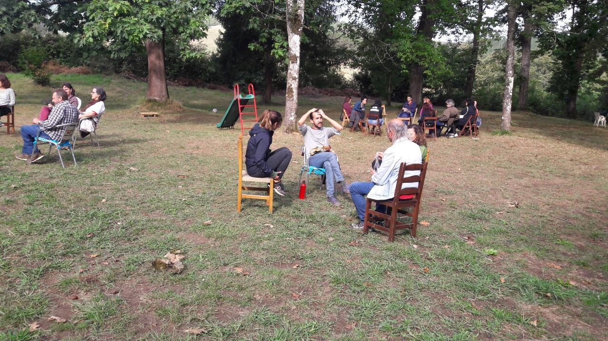

En poco más de dos semanas arrancará en Allariz (Ourense) la próxima Escuela Ramón Fernández Durán, una escuela para la reflexión y la acción colectiva de los movimientos sociales que arrancó en 2015 como una iniciativa de la coordinadora Baladre, CGT y Ecologistas en Acción, y que ha recorrido distintos lugares de la península desde entonces. Desde entonces, hemos abordado temas socio-políticos de especial relevancia en la coyuntura de cada edición, como las distintas crisis: climática, económica, energética; la garantía de los derechos básicos: alimentación, vivienda, salud y cuidados; la guerra y el militarismo; y en general alternativas para transitar hacia una sociedad post-capitalista. 

En esta ocasión, el tema central será la gestión de emergencias y catástrofes relacionadas con el proceso de colapso sistémico del actual modelo capitalista, poniendo la vida en el centro y buscando satisfactores para las necesidades básicas de la población desde la creación de redes de apoyo mutuo y la autogestión comunitaria.

Las últimas catástrofes vividas, como la pandemia de COVID, la Dana de Valencia, la guerra de Ucrania, los incendios masivos o el reciente apagón han puesto de manifiesto la vulnerabilidad de nuestras sociedades y la incapacidad de las administraciones, en situaciones de colapso agudo, para garantizar una vida digna a sus poblaciones. En muchas de estas situaciones, la población ha tenido que organizarse de manera autónoma para hacer frente a las emergencias con los recursos de los que disponía, improvisando respuestas poco eficientes, que no siempre resolvieron las necesidades fundamentales y que no llegaron por igual a todas. Estas experiencias han puesto de manifiesto la importancia de la autogestión y la solidaridad en tiempos de crisis, así como la necesidad de construir redes de apoyo mutuo que nos permitan enfrentar las crisis y catástrofes que están por venir. La vida de miles de personas depende de la capacidad de respuesta de sus comunidades y por ello hemos decidido dedicar la Escuela 2025 a esta cuestión, que además de ser de vital importancia, es urgente.

Entre todas buscaremos formas de organización y herramientas colectivas para garantizar una alimentación sana y suficiente, una vivienda digna, una salud integral tanto física como emocional, una energía limpia y accesible para todas, etc. Trabajaremos estas temáticas en tres talleres: el antes, el durante y el después de una catástrofe. En cada taller se abordarán preguntas como ¿Qué hay que hacer para favorecer una satisfacción de necesidades universal? ¿Qué hay que hacer para que los imaginarios que se expandan sean los ecosociales y no los de extrema derecha? ¿Qué aprendizajes son necesarios? ¿Qué herramientas y recursos materiales son imprescindibles? ¿Qué infraestructuras necesitamos?
¿Qué tipo de organizaciones? ¿Qué alianzas tenemos que priorizar? 

Los talleres serán introducidos por personas que han vivido situaciones de emergencia, quienes contarán sus experiencias y los principales retos que tuvieron que afrontar. Contaremos con gentes de la Koordinadora de Kolectivas del Parke Alcosa de Valencia que hablarán de su experiencia en la Dana, de gentes de la Palma que contarán su experiencia en la erupción del volcán Cumbre Vieja, de la experiencia de los barrios marginales y colapsados como las villas miseria de Argentina, o de expertos técnicos en emergencias del ámbito sanitario y de bomberos. Tras las breves exposiciones, se abrirá un espacio de diálogo, reflexión y construcción colectiva donde trataremos de dar respuesta pragmáticas a las preguntas planteadas. Y es que esta escuela no es un espacio académico, sino un espacio de encuentro e intercambio de aprendizajes basados en experiencias.

Pero la Escuela no es solo un espacio de formación, sino sobre todo un espacio de encuentro y convivencia. En una sociedad hipertecnologizada y cada vez más individualista, donde incluso los movimientos sociales abusamos de los encuentros virtuales, creemos que es fundamental recuperar la presencialidad y la cercanía, desconectando aunque sea por un breve fin de semana de las redes sociales y de estrés y la hiperactividad que muchas veces supone la militancia en los movimientos sociales. Las personas que ya han participado en anteriores ediciones ya saben de lo que hablamos, pero si aún no has tenido la oportunidad de participar, te invitamos a que lo hagas, seguro que no te defrauda.

